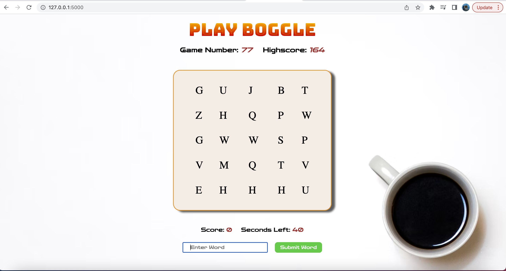
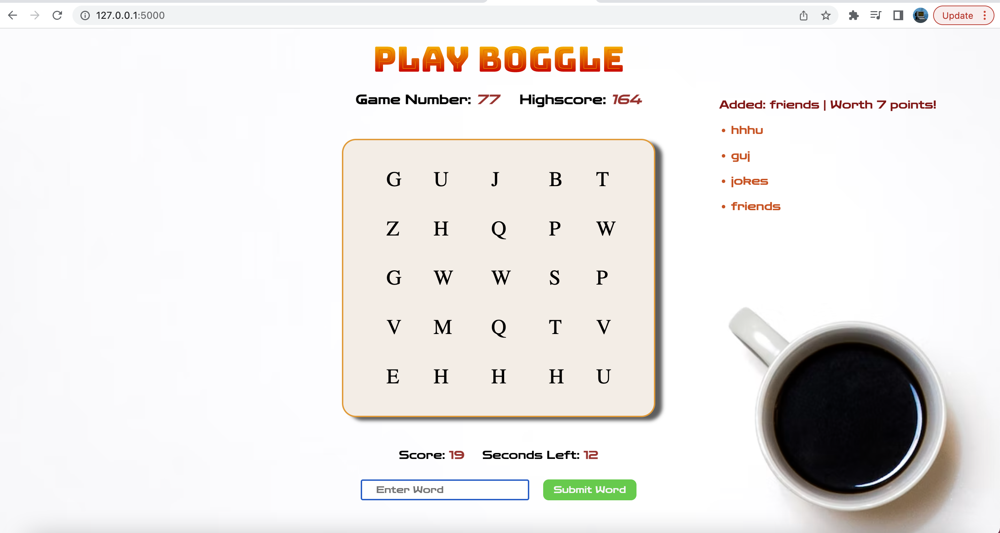

# Flask Boggle Application 

This is a Boggle game created using Javascript, jQuery, and CSS for the front end. And Flask, Python for the back end. 

## Overview

### The challenge

Users should be able to:

- See the game board and type words into the input form.
- Create words from the game board letters and rack up as much points as possible in 60 seconds. 

### Screenshot

This is a screenshot of my game app, and the game over screen. 

### Built with

- Semantic HTML5 markup
- CSS custom properties
- jQuery
- Javascript
- Flask
- Python

### What I learned

I learned to make use of Front End and Back End technologies and make them work together. Using Javascript to manipulate the DOM, and Python to creates routes in Flask. I also used the python unit test to test functions and make sure they work, and requests were going where they were supposed to.

### Continued development

If you have any suggestions, please feel free to reach out to me on what improvements I can make.

### Useful resources

- [MDN](https://developer.mozilla.org) - Read and used the MDN documentation.
- [StackOverflow](https://www.stackoverflow.com) - Used this resource for a few questions.

## Author

- Website - [Josh Villanueva](https://www.linkedin.com/in/patrick-villanueva-/)

